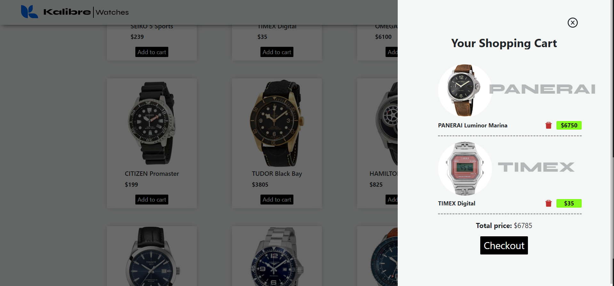

# Online store website made with React

A fictional online store featuring a fully functional shopping cart. This project was built by the use of functional components, Hooks and React Router.

#### Home page:


#### The store:


#### Shopping cart:



[Live Demo](https://gzveriachvili.github.io/shopping-cart/) 🖱️

## Get started

```
git clone git@github.com:gzveriachvili/shopping-cart.git
cd cv-application
npm install
npm start
```

### Built with

- [React](https://reactjs.org/)
- [React Testing Library](https://testing-library.com/docs/react-testing-library/intro/)
- [React Icons](https://www.npmjs.com/package/react-icons)
- [React Bootstrap](https://www.npmjs.com/package/react-icons)
- [Framer Motion](https://www.framer.com/docs/introduction/)

#### The product photos are taken from:

- [Jomashop](https://www.jomashop.com/)
- [Torneau](https://www.tourneau.com/)
